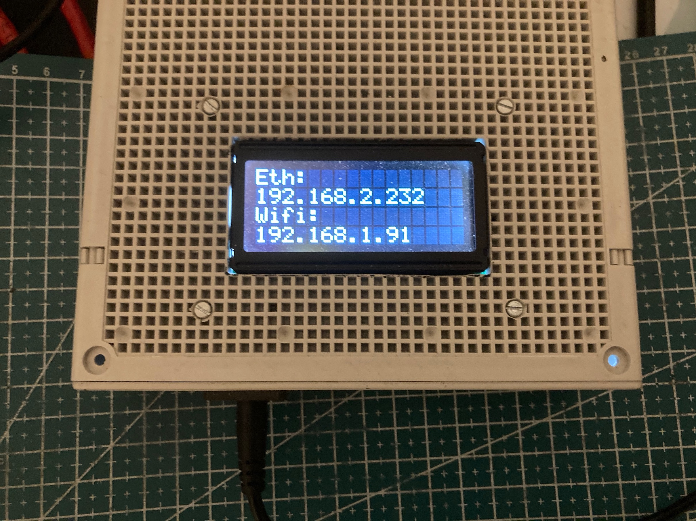

Description:
============

Libraries and sample program/utilities to send text to HD44780 LCD displays, written in a variety of languages: C, CPP, GO, RUST, Python and Bash.

Prerequisites:
==============

I wrote this software avoiding useless dependencies: you need only the compiler in most cases. Only Mash requires i2c tools. 

It's tested using this/these distributions of Linux:

- Ubuntu 18.04.1 LTS
- RaspberryOs (Debian GNU/Linux 11 (bullseye) ARM)

using, as compiler, one in this list:

- clang version 6.0.0-1ubuntu2  aarch64-unknown-linux-gnu
- g++ (Debian 10.2.1-6) 10.2.1 20210110
- go1.10.4 linux/arm64 
- rustc 1.39.0

and with :

- Python 3.6.9
- Python 3.9.2
- Bash  4.4.20(1)-release (aarch64-unknown-linux-gnu)

Harwdare:
=========

I tested this software on:
- NVidia Jetson Nano, using a 4 lines LCD display. Is required a board with GPIO/I2C.
- Raspberry Pi 400 Rev 1.1
I have other hardware to test:  I'll add information here asap.

Installation:
=============

C/CPP version are the classic autotool setting, in Rust and Go a simple Makefile is available, with the classic directives (all, install , etc)

Documentation:
==============

All compiled version have an installable man page.
All the tools have a -h flag showing command line options.

Command Line Examples:
=====================

-  print the string  'Ip: 192.168.0.1' on row 1 (C version): 
   simple_lcd -r1 -t 'Ip: 192.168.0.1'

- Same example, using Rust version: 
  simple_lcd_r -r1 -t'ethernet:'

